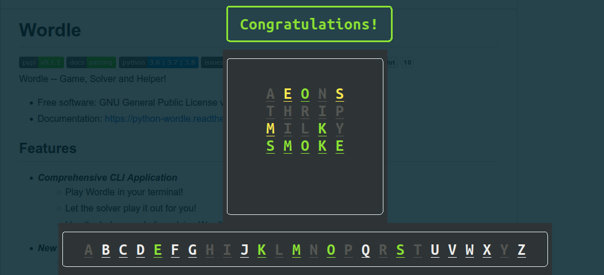

======
Wordle
======

.. image:: https://img.shields.io/pypi/v/python-wordle?color=success
        :target: https://pypi.python.org/pypi/python-wordle

.. image:: https://img.shields.io/pypi/pyversions/python-wordle
        :target: https://pypi.python.org/pypi/python-wordle
        :alt: Python Version Support

.. image:: https://img.shields.io/github/issues/hrishikeshrt/python-wordle
        :target: https://github.com/hrishikeshrt/python-wordle/issues
        :alt: GitHub Issues

.. image:: https://img.shields.io/github/followers/hrishikeshrt?style=social
        :target: https://github.com/hrishikeshrt
        :alt: GitHub Followers

.. image:: https://img.shields.io/twitter/follow/hrishikeshrt?style=social
        :target: https://twitter.com/hrishikeshrt
        :alt: Twitter Followers

Wordle -- Game, Solver and Helper!

* Free software: GNU General Public License v3

Features
--------

* Interactive Wordle game playable in the terminal
* Smart solver that auto-plays and demonstrates logic-based guessing
* Helper mode to assist with solving external Wordles
* Random and seeded gameplay for reproducible runs
* Cleanly structured Python code, easy to follow and extend

How to Run
----------

Clone this repository and run the game using Python 3:

.. code-block:: console

    $ git clone https://github.com/thadela-rohith/Wordle-python.git
    $ cd Wordle-python
    $ python wordle.py

Requirements
------------

No external dependencies required. Works with Python 3.6+.

Game Modes
----------

**Default Mode**  
Play a daily Wordle using a fixed word set.

**Random Mode**  
Use the ``--random`` option to play any random word.

**Solver Mode**  
Let the built-in algorithm solve the word for you using ``--solve``.

**Helper Mode**  
Use ``--helper`` to get guided suggestions for solving third-party Wordles (like on NYT).

Example
=======

Helper Session
--------------

.. code-block:: console

    $ python wordle.py --helper

    Attempt 1
    =========
    Suggestions: [('raise', 94.3)]
    Chosen word: raise
    Result: 01201

    Attempt 2
    =========
    Suggestions: [('plush', 78.2)]
    Chosen word: plush
    Result: 22222

    Congratulations!

Terminology
-----------

* **Known Letters**: Letters known to be in the word based on feedback
* **Coverage**: Percent of possible solutions a word could eliminate
* **Result String**: Feedback like 20100 → Green, Grey, Yellow, Grey, Grey

Planned Improvements
--------------------

* Colored terminal feedback for better UX
* GUI version using Tkinter or PyGame
* Word frequency–based hint system
* Win streak tracking and player stats

License
-------

This project is distributed under the GNU General Public License v3.0.

Acknowledgements
----------------

Inspired by the original project: `python-wordle by @hrishikeshrt <https://github.com/hrishikeshrt/python-wordle>`_

